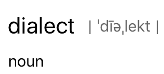

theme: Fira, 6
autoscale: true
slidenumbers: true
slidecount: true
footer: IndyPy September 2017 PBJ

[.slidenumbers: false ]
[.footer: ]
### **IndyPy** March 2018 PBJ

# [fit] Manipulating CSV

# :snake:

#### Calvin Hendryx-Parker
#### [Six Feet Up](http://www.sixfeetup.com)

---


# Battries Included

^ One of Python's true strenghts

^ https://www.flickr.com/photos/johnseb/2452718815

---
# Reading CSV Files

* Easily grab the rows of the file as individual Python lists

```python
import csv

with open("Demographic_Statistics_By_Zip_Code.csv") as f:
    reader = csv.reader(f)
    for row in reader:
        print(row)
```

^ 6 lines of Python needed to print the rows of a CSV file

^ Note: everything in Python is an object, the modules function has returned you a `reader` object that you can now use.

---

# What about line breaks in a field?

^ Open the `reading_multiline.py` file

^ https://www.flickr.com/photos/wonderlane/3085454105

---
# Writing CSV Files

* Write Python sequences to a CSV file

```python
import csv

with open("demo.csv", "w") as f:
    writer = csv.writer(f)
    writer.writerow(('Col 1', 'Col 2', 'Col 3'))
    for i in range(3):
        row = (
            i + 1,
            'Hello World {}'.format(i),
            'IndyPy Rocks'
        )
        writer.writerow(row)
```

---

# Quoting Data

### Sometimes you need to quote fields for special cases

```python
writer = csv.writer(f, quoting=csv.QUOTE_ALL)
writer = csv.writer(f, quoting=csv.QUOTE_MINIMAL)  # <-- Default
writer = csv.writer(f, quoting=csv.QUOTE_NONNUMERIC)
writer = csv.writer(f, quoting=csv.QUOTE_NONE)
```


^ Maybe your destination doesn't correctly read your CSV unless it is quoted

^Quote everything, regardless of type.
Quote fields with special characters (anything that would confuse a parser configured with the same dialect and options). This is the default
Quote all fields that are not integers or floats. When used with the reader, input fields that are not quoted are converted to floats.
Do not quote anything on output. When used with the reader, quote characters are included in the field values (normally, they are treated as delimiters and stripped).

^ https://www.flickr.com/photos/terryfreedman/9576733508

---
# Talking Different Dialects

```python
>>> csv.list_dialects()
['excel', 'excel-tab', 'unix']
```

^ Dialects are just groupings of common settings that can be configured in the module

---

# Dialect Params

* `delimiter`
* `doublequote`
* `escapechar`
* `lineterminator`
* `quotechar`
* `quoting`
* `skipinitialspace`
* `strict`

^ Imagine this is the advanced save dialog of your spreadsheet app.

---
# View a Dialect

```python
>>> dialect = csv.get_dialect('excel-tab')
>>> dialect.
dialect.delimiter         dialect.escapechar        dialect.quotechar         dialect.skipinitialspace
dialect.doublequote       dialect.lineterminator    dialect.quoting           dialect.strict
>>> dialect.delimiter
'\t'
```

---
# Sniffing Out a Dialect

```python
>>> sniffer = csv.Sniffer()
>>> with open('demo.csv') as f:
...     dialect = sniffer.sniff(f.readline())
...
>>> dialect.delimiter
','
>>> dialect.doublequote
False
```

```python
>>> with open('demo.csv') as f:
...     header = sniffer.has_header(f.readline())
...
>>> header
True
```

---
# Special Readers 

```python
>>> with open('banklist.csv') as f:
...     reader = csv.DictReader(f)
...     for row in reader:
...         print(row['Bank Name'])
...
Washington Federal Bank
for Savings
The Farmers and Merchants State Bank of Argonia
Fayette County Bank
Guaranty Bank, (d/b/a BestBank in Georgia & Michigan)
First NBC Bank
Proficio Bank
```

---

```python
>>> reader.fieldnames
['Bank Name', 'City', 'ST', 'CERT', 'Acquiring Institution', 'Closing Date', 'Updated Date']
```

---


# Resources

* [Python CSV Module Docs](https://docs.python.org/3.5/library/csv.html)
* [Doug Hellmann's PyMOTW-3 on CSV](https://pymotw.com/3/csv/index.html)

^ https://www.flickr.com/photos/davidjthomas/16648403629
